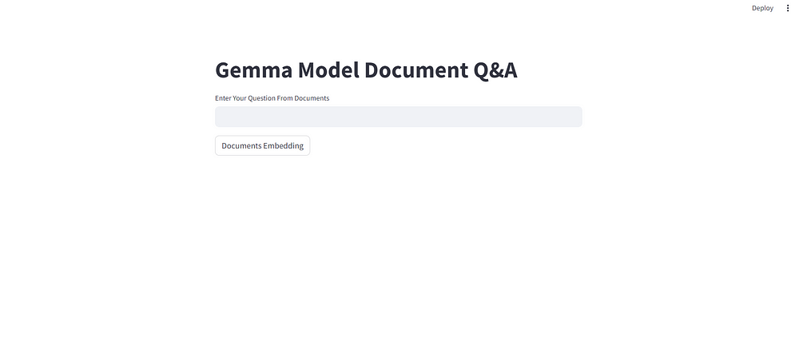

Sure, here's a README.md file for the RAG Model project:

# Retrieval-Augmented Generation (RAG) Model

This repository contains an implementation of a Retrieval-Augmented Generation (RAG) Model using Groq, Gemma Model, and other Python libraries. The RAG Model combines the strengths of an information retrieval system and a generative language model, allowing for accurate and contextual question answering.

## Overview

The RAG Model is designed to ingest documents, split them into chunks, and embed them into a vector space using Google's GenerativeAI Embeddings. When a user asks a question, the relevant document chunks are retrieved from the vector store, and the Gemma model generates a response conditioned on those chunks.

## Components

1. **Document Ingestion**: PDFs are loaded using PyPDFDirectoryLoader and split into chunks using RecursiveCharacterTextSplitter.

2. **Vector Store**: The chunks are embedded into a vector space powered by FAISS, a library for efficient similarity search and clustering of dense vectors.

3. **Retrieval**: When a user asks a question, the most relevant document chunks are retrieved from the vector store using a similarity search.

4. **Generation**: The Gemma-7b language model generates a response based on the retrieved context.

## Setup

1. Clone the repository

2. Install the required dependencies:

```
pip install -r requirements.txt
```

3. Set up the required API keys:

- Create a `.env` file in the project root directory.
- Add your Groq API key and Google API key to the `.env` file:

```
GROQ_API_KEY=your_groq_api_key
GOOGLE_API_KEY=your_google_api_key
```

4. Place your PDF documents in the `financial_docs` directory.

## Usage

1. Run the Streamlit app:

```
streamlit run app.py
```

2. Enter your question in the provided text input field.

3. Click the "Documents Embedding" button to initialize the vector store.

4. The RAG Model will retrieve relevant document chunks and generate a response to your question.



## Applications


- Enterprise Knowledge Bases
- Customer Support
- Research Assistance
- Conversational AI

## Contributing

Contributions are welcome! Please open an issue or submit a pull request if you have any improvements or bug fixes.

## License

This project is licensed under the [MIT License](LICENSE).